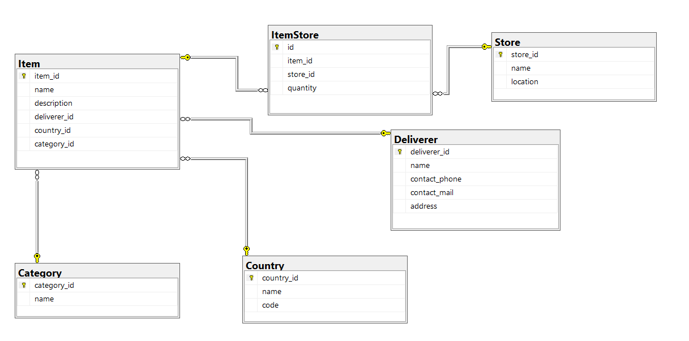
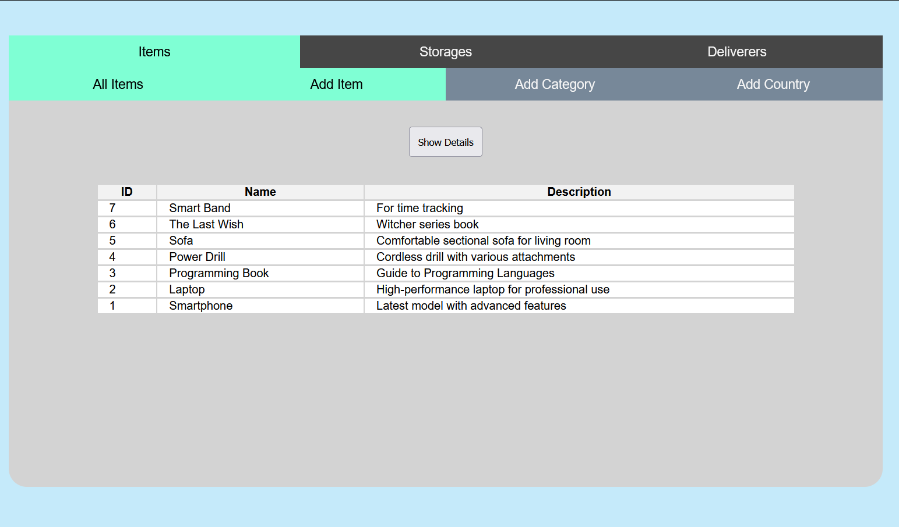
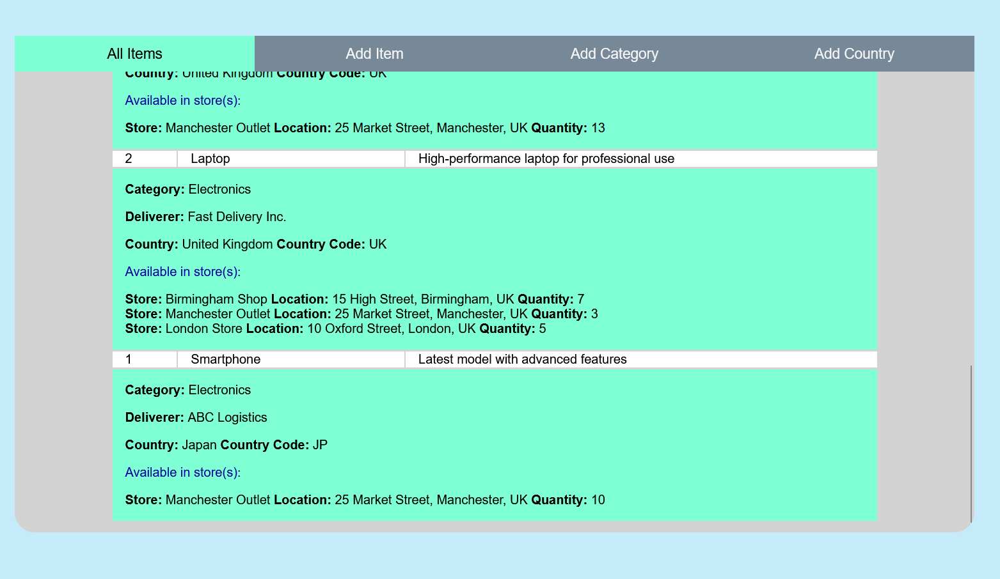
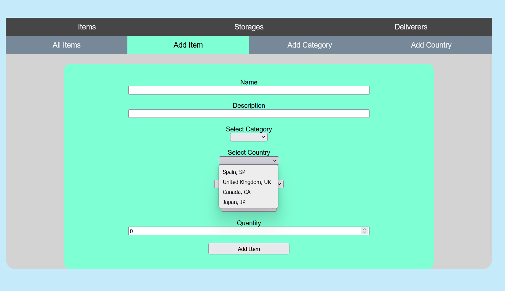
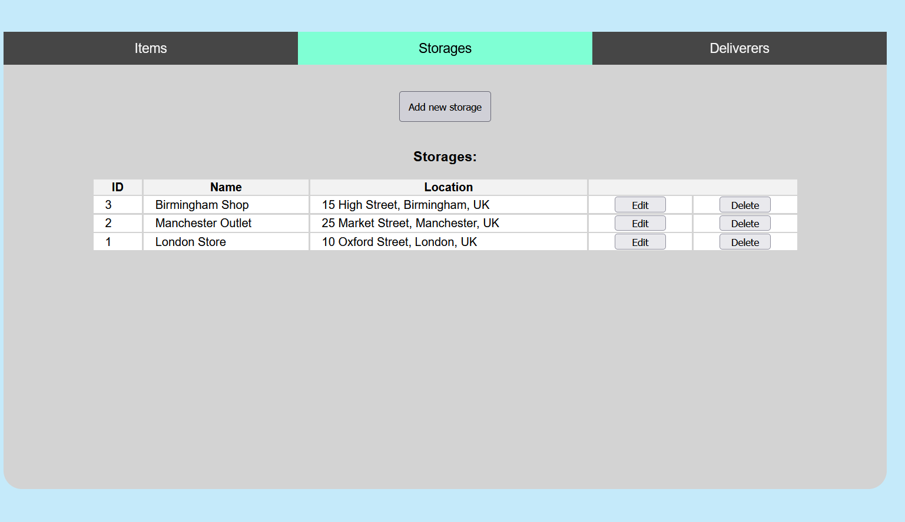
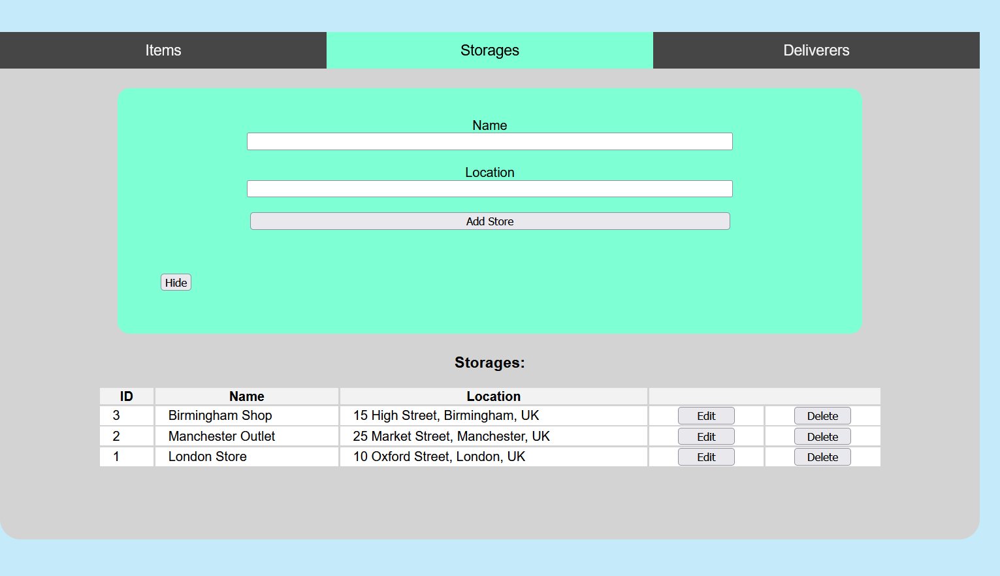
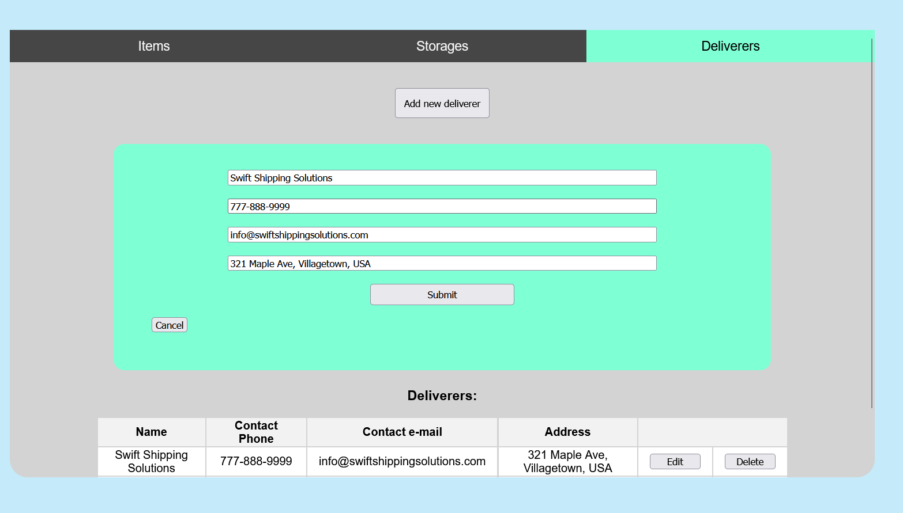

# Storage Manager

Storage Manager is a web application for managing items stored across multiple locations. Users can add, update, and delete both items and storage units, and easily track item availability in each location.

*This project was developed as a university assignment with the main goal of introducing myself to .NET and Angular through a practical application.*

### Tech Stack:
 Angular 

 ASP.NET Core

 Microsoft SQL Server

---
### Overview
The application uses a relational database to manage items, their locations, and related data. The main entities and their relationships are shown in the diagram below:

The main page features a two-level menu: a primary menu and a submenu for item-related actions. It displays a list of all items, with the option to expand entries to view item details, as shown in the images below:

This page allows users to add new items using dropdown menus populated with real-time data from the database:

The Store and Deliverer pages are similar, each displaying a list of existing entries with the option to add a new one. Clicking the corresponding button reveals a form for entering a new entry:

The edit option of both Store and Deliverer entries displays a form pre-filled with the entry's corresponding data.

          
